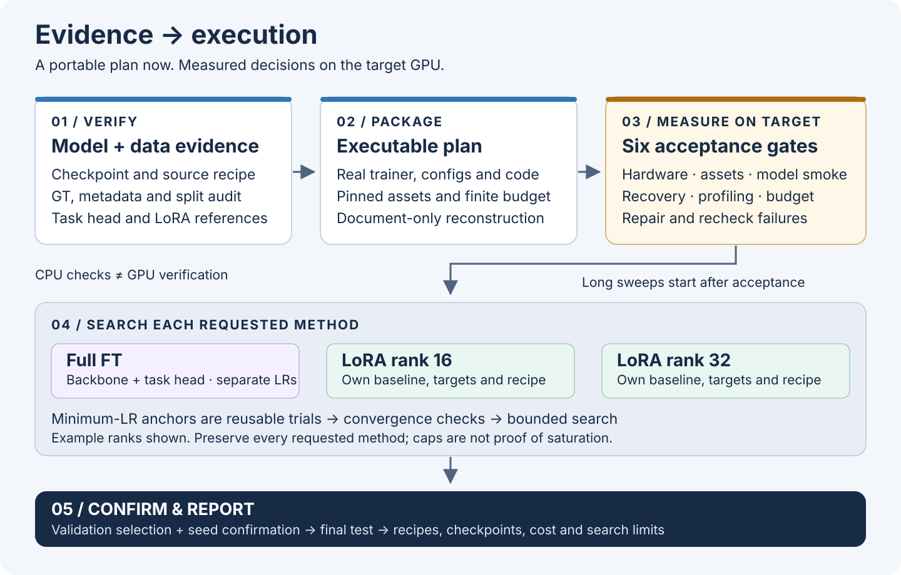
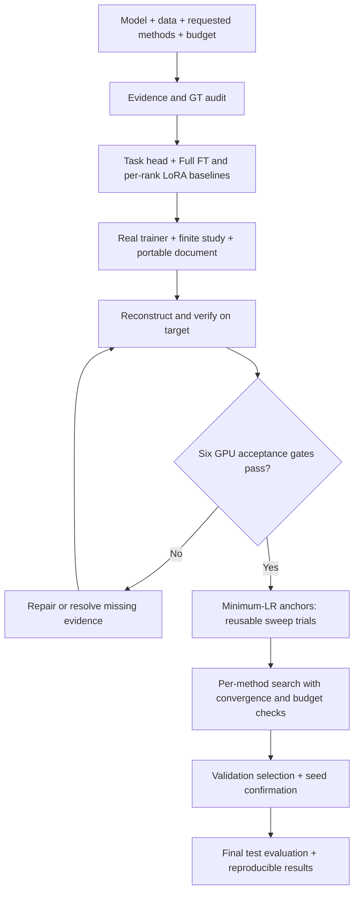

# Train Recipe Sweep

[](https://github.com/ChihyunAhn0309/train-recipe-sweep/actions/workflows/ci.yml)
[](#try-the-cpu-demo)
[](LICENSE)

**Turn a model and dataset into a traceable Full FT or LoRA recipe search.**

A Codex skill for researching checkpoints and training baselines, auditing ground truth, adapting task heads, and planning or running bounded sweeps. Each requested LoRA rank gets its own baseline and search. An executable handoff written without GPUs carries its code and resolves hardware-dependent choices on the target. A specification-only request can finish with implementation and GPU checks explicitly pending.

[Install](#install) · [Use the skill](#use-the-skill) · [CPU demo](#try-the-cpu-demo) · [Validation](docs/validation.md) · [Controller protocol](references/study-controller.md)



> **Validation boundary:** the included tests exercise CPU-side control, transport, accounting and failure handling. They do not establish CUDA performance or successful GPU model training. Every real execution must pass the six [target acceptance gates](references/gpu-acceptance.md). The included worker is an explicitly labeled CPU fixture; the agent must supply the real model-specific trainer in each execution plan.

## What it does

| Stage | Required outcome |
|---|---|
| Verify the starting point | Exact model/data revisions, checkpoint provenance, source recipes, hashes and a GT/metadata inventory. |
| Reconcile every source setting | Resolve config inheritance, defaults and pipeline code; map every source field to each method's target decision, including multi-scale and enabled/disabled controls. |
| Adapt the model | Replace incompatible heads, train the full model for Full FT, and separate head/backbone or head/adapter learning rates. |
| Research LoRA | Find model-specific references and resolve actual module paths, trainable state, scaling and per-rank baselines. |
| Calibrate convergence | Run minimum-positive-LR anchors as actual sweep trials, reuse their results, and distinguish stagnation from learning followed by saturation. |
| Search within budget | Declare finite axes, stop converged trials early, extend improving trials within limits, and reserve finalist confirmation capacity. |
| Transfer or execute | Deliver a reconstructable document, or measure the target GPU and run with durable identities, budgets and recovery. |
| Report | Compare each method against its baseline with validation performance, seed variation, cost, throughput and search coverage. |

“Best” always means **best evaluated within the stated search space and budget**. No finite sweep guarantees a global optimum. Checkpoint download failures do not justify silently switching to random initialization. Test data never selects recipes.

### Source techniques must not disappear

If the original recipe used multi-scale training, the agent must recover its sizes/distribution, cadence, GT transforms and phase schedule. For each method/rank, it records whether to inherit, adapt, compare enabled/disabled, or omit it with a specific reason. Applicable techniques with uncertain transfer receive on/off comparisons within budget; fixed evaluation/TTA settings remain separate. A missing local implementation does not silently become an excluded technique.

The [recipe coverage checker](scripts/recipe_coverage.py) detects unmapped source fields, missing method decisions and declared candidates absent from actual compiled configs. Try the [runnable multi-scale coverage example](examples/recipe-coverage/README.md). Actual pipeline behavior still needs smoke checks; JSON coverage alone cannot prove a historical recipe was fully recovered. See the [reconciliation contract](references/recipe-reconciliation.md).

### Evidence before performance claims

Follow [scientific validation](references/scientific-validation.md) when comparing recipes. Published ranges and code defaults are not necessarily the winning official recipe. Evaluate a source-derived target baseline, then compare baseline and finalists on matched fresh seeds. Keep exploratory winning-seed scores outside confirmation aggregates. Best observed, confirmed, source-reproduced and GPU-verified are separate claims.

For later-stage candidates, [study_extend.py](scripts/study_extend.py) retains completed anchors, results and cumulative costs. The model-specific adapter freezes selection and generates trials; the helper does not select winners or authorize a larger budget.

## Install

In Codex, ask the built-in installer:

```text
$skill-installer Install the train-recipe-sweep skill from
https://github.com/ChihyunAhn0309/train-recipe-sweep
The skill's SKILL.md is at the repository root.
```

Or clone into your project's local skills directory:

```sh
git clone https://github.com/ChihyunAhn0309/train-recipe-sweep.git .agents/skills/train-recipe-sweep
```

The destination must not already contain an installation. Preserve local edits before updating. Codex discovers repository skills under `.agents/skills`; user-wide installations can use `~/.agents/skills`. If the skill does not appear, restart Codex. See the [official skill documentation](https://learn.chatgpt.com/docs/build-skills).

The workflow needs an agent with source research, file and shell capabilities. The bundled helpers use **Python 3.11+ and the standard library**. Actual training dependencies are model-specific and must be pinned in the generated plan. Controller execution supports Windows 10+ and Linux on local filesystems; macOS execution, distributed trials and cluster scheduling are outside this controller's scope.

## Use the skill

### Make a plan without a GPU

```text
$train-recipe-sweep
Model: <exact model ID and variant>
Dataset: <release and task>
Splits: train=<subsets>, validation=<subsets>, test=<optional held-out split>
Methods: full_ft, lora_r16, lora_r32
Metric: <name and maximize/minimize>
Target: <host, allocated GPU type/count/VRAM>
Budget: <total GPU-hours and storage limit>
Mode: plan

I have no GPU here. Deliver one portable plan document containing the real
trainer, configs, acquisition/audit code, controller integration and commands.
Verify reconstruction from the document alone. Leave actual GPU measurements
pending and resolve them on the target before long training.
```

The agent asks about consequential missing inputs. If you delegate choices, it records assumptions and uses finite proposed budgets rather than treating “optimal” as unlimited compute. A design can be useful while incomplete; a complete handoff must include its real implementation. See [portable plans](references/portable-plan.md).

### Execute on the target

```text
$train-recipe-sweep Use the attached portable plan on the allocated GPU host.
Remaining total budget: 12 GPU-hours, including verification and profiling.
Check the real assets, GT, head/adapters, save/reload/resume and throughput.
Fix and revalidate failures, then execute the bounded search and report the
best confirmed configuration for every requested method/rank.
```

Before long training, all six target gates must pass: **hardware/environment, assets/GT, model smoke, controller recovery, performance profiling, and budget feasibility**. Evidence is bound to code, study configuration and device identity. A changed environment invalidates affected checks. Hashes prove file integrity; the executing agent must also inspect the measurements and recheck the actual target.

High utilization means useful throughput with measured memory headroom. Packing must be measured with concurrent workloads; effective batch semantics stay fixed unless declared as another trial. Filling VRAM with unused allocations is not optimization.

## Try the CPU demo

From a writable checkout, run:

```sh
python tools/run_cpu_demo.py --output ./demo-run
```

Use a new output directory each time. The demo copies the controller, worker and example study, runs four synthetic trials, resumes the completed study, and checks that no attempts or costs were duplicated. It prints statuses and the report location. **No model weights, dataset downloads, CUDA or GPU training are involved.** The fake worker refuses GPU mode.

Run the complete regression suite:

```sh
python -B -m unittest discover -s scripts -p "test_*.py" -v
python tools/check_repository.py
```

Tests use temporary directories and real child processes. They exercise malformed results, checkpoint integrity, identity changes, concurrent ownership, budget persistence, crash recovery and document reconstruction. See [validation scope and known limits](docs/validation.md); CI is linked above.

## How the pieces fit

| File | Responsibility |
|---|---|
| [SKILL.md](SKILL.md) | Agent workflow, research decisions and reference routing. |
| [sweep_guard.py](scripts/sweep_guard.py) | Immutable trial fingerprints and configurable plateau decisions. |
| [recipe_coverage.py](scripts/recipe_coverage.py) | Source-setting coverage, per-method on/off decisions and compiled candidate reconciliation. |
| [runtime_guard.py](scripts/runtime_guard.py) | Asset checks, output identity and persistent local execution budgets. |
| [plan_bundle.py](scripts/plan_bundle.py) | Pack, verify and reconstruct a document containing hashed UTF-8 files; never executes them. |
| [study_controller.py](scripts/study_controller.py) | Local SQLite claims, single-device workers, anchor gating, physical-device accounting and bounded recovery. |
| [study_extend.py](scripts/study_extend.py) | Append-only stage transitions retaining anchors, results and cumulative budgets. |
| [fake_worker.py](scripts/fake_worker.py) | Synthetic CPU protocol fixture for testing only. |

The controller supports **one host and one physical GPU per worker**, with measured packing for independent workers. A real project adapter must implement training, task-specific evaluation/convergence, consistent checkpoints and resume state. Multi-GPU trials and clusters need a suitable project scheduler.



## Read further

- [Inputs, study identity and deliverables](references/contracts.md)
- [Evidence, checkpoints and ground truth](references/evidence-and-data.md)
- [Source recipe reconciliation and technique ablations](references/recipe-reconciliation.md)
- [Model heads and LoRA adaptation](references/model-adaptation.md)
- [Search spaces and stopping](references/search-and-stopping.md)
- [Baseline comparability, confirmation and evidence levels](references/scientific-validation.md)
- [GPU execution](references/execution.md) and [acceptance](references/gpu-acceptance.md)
- [Portable plan contract](references/portable-plan.md)
- [Guard tools](references/guard-tool.md) and [controller protocol](references/study-controller.md)
- [Primary research starting points](references/sources.md)
- [Contributing](CONTRIBUTING.md)

The workflow illustration is original, editable SVG. Its visual hierarchy and relationship checks were informed by [Paper Figure](https://github.com/JYS1025/paper-figure); no source code or artwork from that repository is bundled. This skill does not require Paper Figure.

## License

[MIT](LICENSE), copyright 2026 Chihyun An. Model weights, datasets and referenced third-party code retain their own licenses and access conditions; they are not distributed in this repository.
